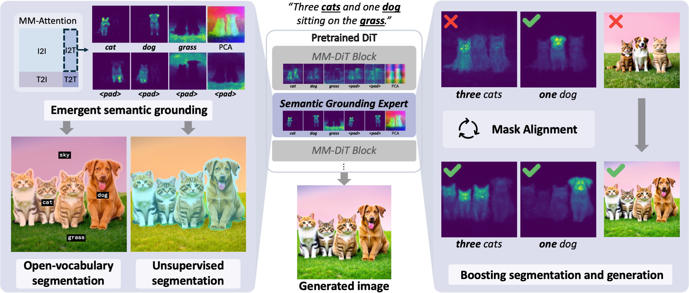
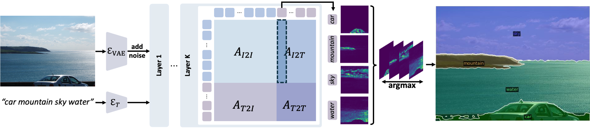
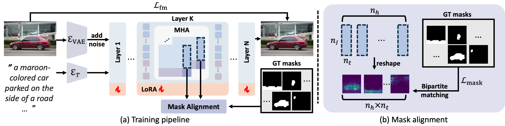

# Seg4Diff: Unveiling Open-Vocabulary Segmentation in Text-to-Image Diffusion Transformers [NeurIPS 2025]


<a href="https://arxiv.org/abs/XXXX"></a>
<a href="https://cvlab-kaist.github.io/Seg4Diff"></a>  

This is the official implementation of Seg4Diff.
<br>

by [Chaehyun Kim<sup>1</sup>](https://kchyun.github.io/), 
[Heeseong Shin<sup>1</sup>](https://hsshin98.github.io/), 
[Eunbeen Hong<sup>1</sup>](https://github.com/eunbeen-hong), 
[Heeji Yoon<sup>1</sup>](https://yoon-heez.github.io/), 
[Anurag Arnab](https://anuragarnab.github.io/), 
[Paul Hongsuck Seo<sup>2</sup>](https://phseo.github.io/), 
[Sunghwan Hong<sup>3,&dagger;</sup>](https://sunghwanhong.github.io/), 
[Seungryong Kim<sup>1,&dagger;</sup>](https://cvlab.kaist.ac.kr/members/faculty) <br>

<sup>1</sup> KAIST AI, <sup>2</sup> Korea University, <sup>3</sup> ETH Zürich <br>
(<sup>&dagger;</sup>Co-Corresponding Author)
## Introduction


**Seg4Diff** is a systematic framework that analyzes and enhances the emergent semantic grounding capabilities of multi-modal diffusion transformers (MM-DiTs). We discover that specific intermediate layers, which we term **semantic grounding expert layers**, naturally produce high-quality zero-shot segmentation masks by aligning text tokens with corresponding image regions. Building on this insight, we introduce a lightweight LoRA fine-tuning method, **Mask Alignment (MA)**, to further refine this alignment, simultaneously improving both open-vocabulary segmentation and text-to-image generation quality.

For further details and visualization results, please check out our [paper]() and our [project page](https://cvlab-kaist.github.io/Seg4Diff).

## Installation
Please follow [installation](INSTALL.md). 

## Data Preparation
We largely follow [PixelCLIP](https://github.com/cvlab-kaist/PixelCLIP)'s dataset preparation procedure. Please refer to [dataset preperation](datasets/README.md).

## Zero-shot Evaluation
<!--  -->

`eval_*.sh` automatically evaluates the model following our evaluation protocol, with pre-trained [Stable Diffusion 3 (SD3)](https://huggingface.co/stabilityai/stable-diffusion-3-medium) by default. To use different models like [Stable Diffusion 3.5](https://huggingface.co/stabilityai/stable-diffusion-3.5-medium) or [Flux.1-dev](https://huggingface.co/black-forest-labs/FLUX.1-dev), add options to specify the backbone. The weights will be downloaded automatically in the first execution.

### Evaluation script
```bash
sh eval_*.sh [CONFIG] [NUM_GPUS] [OUTPUT_DIR] [OPTS]

# Open-vocabulary semantic segmentation
sh eval_ovss.sh ./configs/eval_ovss.yaml 1 ./output/ovss 
# Unsupervised segmentation
sh eval_unsup.sh ./configs/eval_unsup.yaml 1 ./output/unsup
```

## Training
<!--  -->

```run.py``` trains the model in default configuration and evaluates the model after training, which is executed by ```run.sh```. We provide generated captions for 10k sampled subset of SA-1B and COCO, which can be found in ```datasets/captions```.

To train or evaluate the model in different environments, modify the given shell script and config files accordingly.

### Training script
```bash
sh run.sh [CONFIG] [NUM_GPUS] [OUTPUT_DIR] [OPTS]

# With SA-1B masks and captions
sh run.sh configs/train_sa1b.yaml 2 output/
# With COCO masks and captions
sh run.sh configs/train_coco.yaml 2 output/
```
### Pretrained weights

We provide [SA-1B-trained](https://huggingface.co/chyun/seg4diff-sa1b-lora) and [COCO-trained](https://huggingface.co/chyun/seg4diff-coco-lora) lora weights for Stable Diffusion 3 (SD3). Download the `.pth` model weights to your desired directory (from the Hugging Face Hub):
```python
from huggingface_hub import hf_hub_download

# Download COCO-trained lora weights
LORA_PATH_COCO = hf_hub_download(
    repo_id="chyun/seg4diff-coco-lora",
    filename="lora_weights.pth",
    cache_dir="/path/to/save/coco",
)
print("Downloaded to: ", LORA_PATH_COCO)

# Download SA1B-trained lora weights
LORA_PATH_SA1B = hf_hub_download(
    repo_id="chyun/seg4diff-coco-lora",
    filename="lora_weights.pth",
    cache_dir="/path/to/save/coco",
)
print("Downloaded to: ", LORA_PATH_SA1B)
```

To run the evaluation script with lora weights, specify the model weights like following:
```bash
# Evaluate COCO-trained model
sh eval_ovss.sh ./configs/eval_ovss.yaml 1 ./output/ovss MODEL.WEIGHTS LORA_PATH_COCO

# Evaluate SA1B-trained model
sh eval_ovss.sh ./configs/eval_ovss.yaml 1 ./output/ovss MODEL.WEIGHTS LORA_PATH_SA1B
```


## Citing Seg4Diff

```BibTeX

```
